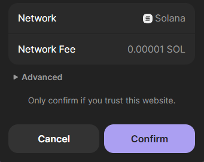
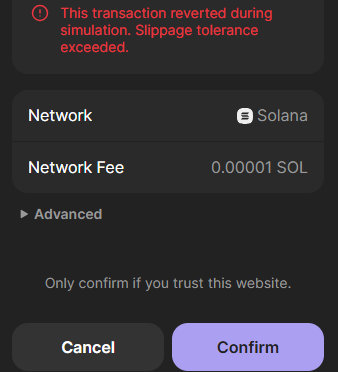
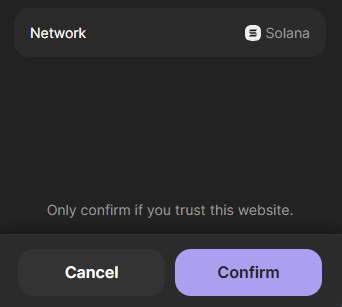
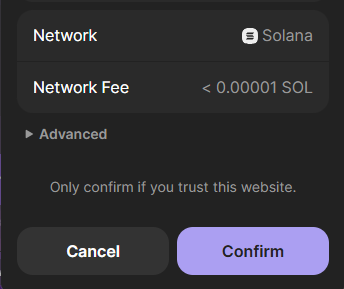
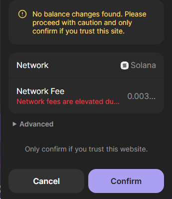
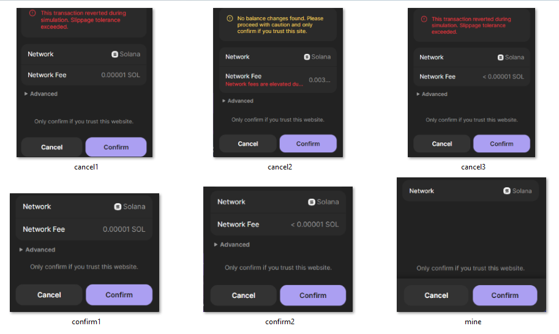

# Mac-PyAuto-Auto-Clicker
Use this script for automating clicks on a MacOS. Script is setup for wallet confirmations or cancels depending on users saved screenshots. 

Images in this repository will not work for your setup and are intended for example and reference purposes only. You must take your own screenshots using your main monitor (must be monitor 1 in multi monitor setups).

# PyAutoGUI Pond0x Automation Script

## Overview

This PyAutoGUI automation script was specifically designed for **Pond0x crypto swapping and starting the crypto miner**. It automatically detects and clicks on various popup windows that appear during cryptocurrency transactions and mining operations, eliminating the need for manual intervention.

## Purpose and Functionality

### Primary Use Case: Pond0x Operations
- **Automated Transaction Confirmations**: Automatically confirms swap transactions between cryptocurrencies (e.g., SOL to wPOND)
- **Mining Session Management**: Automatically starts and manages crypto mining sessions
- **Error Handling**: Manages common errors like slippage tolerance exceeded, network fee notifications, and insufficient balance warnings
- **Multi-popup Support**: Handles various popup types with customizable confirm/cancel actions

### How It Works
1. **Image Recognition**: Uses OpenCV and PyAutoGUI to scan the screen for predefined popup images
2. **Smart Clicking**: Automatically clicks the appropriate button (Confirm or Cancel) based on popup type
3. **Offset Calibration**: Uses adjustable X/Y offsets to ensure accurate button clicking
4. **Real-time Monitoring**: Continuously scans the screen for new popups
5. **GUI Control Panel**: Provides a user-friendly interface for starting/stopping and adjusting settings

## Key Features

- **Multiple Image Support**: Handles up to 11 different popup types simultaneously
- **Retina Display Compatible**: Includes scaling adjustments for high-DPI displays
- **Safety Features**: Built-in fail-safe (move mouse to upper-left to abort)
- **Error Recovery**: Continues operation even when individual images can't be found
- **Customizable Offsets**: Fine-tune click positions for different popup layouts
- **Real-time Feedback**: Console logging shows detection and click activities

## System Requirements

- **Operating System**: macOS 
- **Python**: 3.11.1 or higher
- **Dependencies**:
  - `pyautogui` - Screen automation and image recognition
  - `opencv-python` - Enhanced image processing capabilities
  - `tkinter` - GUI control panel (included with Python)

## File Structure

```
~/PyAutoGUI/
├── autoclicker2.py          # Main script file
├── mine.png                 # Mining confirmation popup
├── confirm1.png             # Primary transaction confirmation
├── confirm2.png             # Network fee confirmation
├── confirm3.png             # Additional confirmation popup
├── confirm4.png             # Additional confirmation popup  
├── confirm5.png             # Additional confirmation popup
├── cancel1.png              # Slippage error popup
├── cancel2.png              # Balance insufficient popup
├── cancel3.png              # Additional cancel popup
├── cancel4.png              # Additional cancel popup
└── cancel5.png              # Additional cancel popup
```

## Security and Safety

### Built-in Safety Features
- **Fail-safe Mechanism**: Move mouse to screen corner to immediately stop
- **Screen Bounds Checking**: Prevents clicking outside visible screen area
- **Error Handling**: Graceful handling of image loading and detection failures
- **Manual Override**: GUI stop button for immediate termination

### Important Security Notes
⚠️ **WARNING**: This script will automatically click on ANY popup that matches your saved screenshots across your entire monitor. Only use when actively performing Pond0x operations.

## Configuration

### Setup
## !!!REMEMBER!!!

## The pyautogui script WILL click ALL pop ups that match the screenshots you take for the ENTIRE monitor that are saved in the Pyautogui folder.

## IF YOU ARE NOT USING IT FOR AUTO MINING/SWAPPING TURN IT OFF!!!!

If you get stuck tag and ping me in 
https://discord.com/channels/1335026643214929952/1352139613539401760

Mac python Download
https://www.python.org/downloads/release/python-3111/

Mac pyautogui  instructions 
https://x.com/i/grok/share/R4LDUWywrP3jwDFTkIAIFNSab

Mac Pyautogui Script
(This is the script you will copy in step 4 of the instructions above. Scroll down until you see a box with colored text. That is what you copy.)
https://x.com/i/grok/share/LeP4zirGHbYHfXU7kiaG7mfdT

When you install python install 3.11.11 i have added a link to the correct download  page.

*This is not needed if you are using the Ez Mode extension.*

Auto Clicker

https://mahdi.jp/apps/autoclick

## Step 1: Install Python
*Skip if you are already running the previous PyAutoGui script*

Your Mac doesn’t come with the full Python setup we need, so let’s install Python 3.11.1 from a specific link.

- Open your web browser:
  - At the bottom of your screen in the Dock (the row of app icons), find Safari (a compass icon) or Chrome (a red-yellow-green circle) and click it.
- Go to the Python download page:
  - In the address bar at the top, click, then type or paste this exact link:  
    https://www.python.org/downloads/release/python-3111/

  - Press Enter on your keyboard.
- Download Python 3.11.1:
  - Scroll down the page until you see a section called “Files.”
  - Look for “macOS 64-bit universal2 installer” (it’ll say something like python-3.11.1-macos11.pkg).
  - Click that link to start the download.
- Open the downloaded file:
  - After a few seconds, check the bottom of your browser or your Downloads folder:
    - In Safari, click the downward arrow in the top-right corner to see it.
    - In Chrome, look at the bottom bar or click the three dots (top-right) > “Downloads.”
  - The file will be named python-3.11.1-macos11.pkg. Double-click it.
- Run the installer:
  - A window pops up. Click “Continue” (bottom-right) three times to move through the welcome screens.
  - Click “Agree” when it asks about the license.
  - Click “Install” (it might show space needed, like 50MB—that’s fine).
  - If it asks for your password, type the one you use to log into your Mac, then click “OK” or press Enter.
  - Wait a minute—it’ll say “Installing” with a progress bar. When it says “The installation was successful,” click “Close.”

## Step 2: Open Terminal
*Skip if you are already running the previous PyAutoGUI script*

Terminal is a tool where we’ll type commands. It’s easy—I’ll guide you!

- Find Terminal:
  - Click the Apple logo () in the top-left corner of your screen.
  - Click “System Settings” or “System Preferences” (depending on your macOS version).
  - OR, press Command (⌘) (the key with a cloverleaf next to the spacebar) + Space.
- Search for Terminal:
  - A search bar (Spotlight) pops up. Type Terminal.
  - When “Terminal” appears (a black box icon with white text), press Enter or click it.
- Understand Terminal:
  - A black window opens with text like yourname@Mac ~ % or $. That’s normal—it’s ready for your commands.

## Step 3: Install PyAutoGUI
*Skip if you are already running the previous PyAutoGUI script*

The script needs PyAutoGUI to work. We’ll add it using Terminal, and we’ll upgrade a tool called pip too.

- Type the first command:
  - In Terminal, type this exactly (copy-paste if you can):
    ```
    pip3 install pyautogui
    ```
  - Press Enter.
- Wait for it to finish:
  - Text will scroll by—it’s downloading and installing. This takes 1-2 minutes.
  - When it’s done, you might see a message saying “You should consider upgrading pip” with a command. Even if you don’t, let’s upgrade it now.
- Upgrade pip:
  - Type this in Terminal and press Enter:
    ```
    python3 -m pip install --upgrade pip
    ```
  - Wait a minute—it’ll update pip. You’ll see text scroll by, and then it’ll return to a % or $ prompt.
- Add one more tool:
  - Type this and press Enter:
    ```
    pip3 install opencv-python
    ```
  - Wait again (1-2 minutes). This helps the script “see” the Confirm button.

## Step 4: Get the Script
We need to grab the script from an online link, and we’ll use the copy button for the one with colored text.

- Open the link:
  - In your browser, go to this X conversation: https://x.com/i/grok/share/LeP4zirGHbYHfXU7kiaG7mfdT

  - You’ll see a conversation with some text and code.
- Copy the script with colored text:
  - Look for a box of code that has colored text—it’s the script we want. The text will have colors like:
    - import in purple.
    - Words like True or False in orange.
    - Numbers like 0.1 or 2 in green.
    - Comments starting with # in gray.
  - At the top-right of this colored script box, you’ll see a “Copy” button (it might look like a small clipboard icon or say “Copy”).
  - Click that “Copy” button—it’ll copy the entire colored script for you automatically.

## Step 5: Create, Modify, and Save the Script and Prepare the Image
Now we’ll create the script, update it with your username, save it, and set up the “Confirm” button image—all in one go.

- Open TextEdit:
  - Press Command (⌘) + Space.
  - Type TextEdit and press Enter. A blank white window opens.
- Paste the script:
  - Click inside the TextEdit window, then press Command (⌘) + V to paste the script. (It’ll lose the colors in TextEdit—that’s okay!)
- Switch to plain text:
  - In the top menu, click Format > Make Plain Text (if it says “Make Rich Text,” skip this—it’s already plain).
- Update the script with your username:
  - Find the line that says: BASE_DIR = "/Users/YourUsername/Pyautogui/"(use the search: press Command (⌘) + F, type YourUsername, and press Enter).
  - Replace YourUsername with your username:
    - To find your username, open Finder (the blue face icon in your Dock). In the sidebar on the left, look for your home folder—it’s usually your name (e.g., “jane” for /Users/jane).

- Make a folder: *This Should be done if already running the previous PyAutoGUI script*
  - Open Finder (the blue face icon in your Dock).
  - In the sidebar on the left, click your username (e.g., “jane”—it’s your home folder).
  - If it does not appear, in Finder and go to Finder > Preferences > Sidebar. Check the box next to your home folder to display it in the sidebar
  - Right-click (or two-finger tap) in the empty space, then click “New Folder.”
  - Name it PyAutoGUI and press Enter.

- Save the script in the folder:
  - Back in TextEdit, click File > Save.
  - In the “Save As” box, type Mac-auto-clicker.py (make sure it ends with .py).
  - Where to save:
    - Click the little arrow next to “Save As” to expand the options.
    - In the sidebar, click your username, then double-click the PyAutoGUI folder.
    - Click “Save.”
  - If it asks about “.py,” click “Use .py.”

# Step 6
now we will create take a few screen shots of the Phantom popup windows.

travel to Pond0x.com and perform a swap of Sol to wPOND. DO NOT CONFIRM THE TRANSACTION
once you have the popup on screen using your keyboard press Press Command (⌘) + Shift + 4
take your cursor over to the popup , click and hold, then drag a box around the area seen in the image with this message.
if you see a popup to open the screen shot do so.
if not, open your file explorer and go to your "photos" and look for a folder titled screenshots. right click the icon and select open with and select the snipping tool.
once open you can further crop the image to trim down excess borders not seen in the example image. 

click the save icon and travel to the pyautogui folder we created in step 4 save the file as "confirm1.png"

check the folder to ensure the image is now saved there




this step can be performed with any wallet that you are using. 

IMPORTANT NOTE: once this script is started it will approve ANY and ALL popups that match your images. If you are not using the auto swapper TURN OFF THE SCRIPT!

The next image we are going to grab will be off the slippage tolerance exceeded popup.

in order to force this image we will adjust our slippage to Fixed and a value of 0.01% and use $SOL>USDC.

once we do that we can repeat the above actions. Cancel and retry until you see the image in this message. we will call this image cancel1.png




Finally we will now grab the popup for the xminer when we start a mining session.

Again follow the steps at the beginning of this section to capture the screen shot except you will start a mining session and use the confirm popup that appears. you will want it to look like the example in this message.

we will call this "mine.png"




Additionally you will encounter other popups that are not listed here. you will want to grab screen shots of them and save them.  the first image you will notice a < symbol in the network fee section. you will want to save this one as "confirm2.png". The other is a no balance found error message, This one will need to be saved as cancel2.png. these are both built into the script and after saving will be handled appropriately.

Any other popups that appear will cause the script to pause, making it easy to grab them. if you encounter one, and after grabbing the image and cropping to look similar to the other examples here you can save it as either:
(if you want confirm clicked)
confirm3.png 
confirm4.png
confirm5.png
(if you want cancel clicked)
cancel3.png
cancel4.png
cancel5.png

This gives you a little customization ability to help the script work for you. If you run out of image slots then let us know and we can help you with adding more to the script.

 


## Step 7: Give Python Permission
*This should be done if already running the previous PyAuotGUI script*

macOS needs to allow Python to control your screen.

- Open System Settings:
  - Click the Apple logo () in the top-left corner.
  - Click “System Settings” (or “System Preferences” on older macOS).
- Go to Accessibility:
  - Scroll down in the sidebar and click “Privacy & Security” (or “Security & Privacy”).
  - Click “Accessibility.”
- Unlock it:
  - At the bottom-left, click the lock icon.
  - Type your Mac password and click “Unlock.”
- Add Python:
  - Click the + button below the list.
  - A Finder window opens. Click “Applications” in the sidebar.
  - Find “Python 3.11” (since we installed 3.11.1), click it, then select “Python.app” inside.
  - Click “Open.”
  - Ensure “Python” is in the list and checked.
- Lock it back:
  - Click the lock again to lock it.

## Step 8: Run the Script
Let’s test it from the right folder!

- Go to the PyAutoGUI folder in Terminal:
  - In Terminal, type:
    ```
    cd ~/PyAutoGUI
    ```
  - Press Enter. (This takes you to the PyAutoGUI folder you made in your home directory in Step 5.)
- Run it:
  - Type:
    ```
    python3 Mac-auto-clicker.py
    ```
  - Press Enter.
- What you’ll see:
Screen size: 1920x1080 pixels
Attempting to initialize Tkinter...
Tkinter initialized successfully.
Start button created
Stop button created
Starting Tkinter mainloop...

if so then the script is running as intended and you should now have a control panel on screen.

The script will print error messages for the missing images. This is normal, as you encounter and save the popup images these will disappear.

# Step 9

now we will create a command cheat sheet for you to reference when you need to start the autoswap script

open a new notepad document and paste the commands in the following message.

*If you are using the old pyautogui script you will have two run commands now, autoswap.py and autoswap2.py. this is so if you do not get the newest one running immediately you can still revert back to and use the old one.*


cd ~/PyAutoGUI
python3 Mac-auto-clicker.py


then save as, name it cheat sheet, and put it into pyautogui folder or save it to your desktop for easy finding

# Step 10
minimize the command prompt window.
bring back your pond0x browser window and the new Autoclicker control panel.

on the new control panel you will notice that there are two sections to adjust x and y coordinates for the confirm offsets and the cancel offsets. these are the button locations.

Before you can run the auto clicker without worry, you will need to fine tune these values to ensure it clicks accurately on each style button. simply stop the clicker with the stop button change the value in x for horizontal direction or y for vertical direction. use small increments probably no more than 5 at a time to get it just right. Do not run the extension while you are doing this. Simply manually process transactions through.

to fine tune the cancel button apply the same settings as you did to force the popup you grabbed the image from in step 6.

Once you have them set, return to your cheat sheet and record the confirm and cancel x,y coordinates. You will need to re enter these every time you restart the autoclicker program after you close the window.


# Congratulations you are now ready to press start and begin your automation journey. 

To end the Autoclicker program simply close the control panel window or close command prompt.

To restart simply open command prompt and your cheat sheet, copy paste each command line into the terminal one at a time and hit enter after each. Once the Autoclicker control panel is on screen re enter your saved coordinates from the cheat sheet and your ready to press start.

## !!!REMEMBER!!!

## The pyautogui script WILL click ALL confirm images that match your screen shots for the ENTIRE monitor.

## IF YOU ARE NOT USING IT FOR AUTO MINING/SWAPPING TURN IT OFF!!!!

Here are all the images I currently have in use. Watch for new ones and be sure to grab them when you can. A quick way to grab them is to simply screenshot the entire screen and then crop the image to just area needed within the popup.



### Advanced Configuration
- **Confidence Level**: Adjust image recognition sensitivity (default: 0.9)
- **Scan Delay**: Modify scanning frequency (default: 0.2 seconds)
- **Click Delay**: Adjust pause after clicking (default: 2 seconds)
- **Retina Scaling**: Configure for different display types

## Other Potential Use Cases

While designed specifically for Pond0x, this script framework can be adapted for other automation scenarios:

### General Applications
- **Web Application Testing**: Automate clicking through web app workflows
- **Game Automation**: Handle repetitive clicking in browser or desktop games  
- **Software Installation**: Automate installer wizards and license agreements
- **Data Entry Tasks**: Speed up forms that require frequent confirmations
- **System Maintenance**: Automate routine popup dismissals during updates

### DeFi and Crypto Applications
- **Multi-DEX Trading**: Adapt for other decentralized exchanges
- **Yield Farming**: Automate reward claiming across multiple platforms
- **NFT Minting**: Handle high-frequency minting operations
- **Liquidity Pool Management**: Automate LP token staking/unstaking
- **Cross-chain Bridging**: Manage bridge transaction confirmations

### Business Process Automation
- **Batch Processing**: Handle confirmation dialogs in data processing workflows
- **Report Generation**: Automate report export confirmations
- **Email Marketing**: Handle bulk sending confirmations
- **Customer Support**: Automate ticket system interactions

### Development and Testing
- **QA Testing**: Automated UI testing for popup-heavy applications
- **Deployment Automation**: Handle deployment confirmation dialogs
- **Database Operations**: Automate backup/restore confirmations
- **Server Management**: Handle system administration prompts

## Customization Guidelines

### Adding New Popup Types
1. **Capture Screenshot**: Use macOS screenshot tool (Cmd+Shift+4)
2. **Crop Image**: Remove excess borders, focus on popup content
3. **Save with Convention**: Use `confirm#.png` or `cancel#.png` naming
4. **Update Script**: Add new image to `IMAGE_CONDITIONS` array if needed

### Modifying Click Behavior
```python
# Example: Add new popup type
{"name": "newpopup.png", "action": "confirm"}  # or "cancel"
```

### Adjusting Performance
```python
# Scan frequency (lower = faster, higher CPU usage)
time.sleep(0.2)  # Current setting

# Image recognition sensitivity
confidence=0.9   # Range: 0.1 to 1.0
```

## Troubleshooting

### Common Issues
- **Permission Denied**: Enable Accessibility and Screen Recording in macOS System Preferences
- **Images Not Found**: Verify screenshot quality and file paths
- **Wrong Click Positions**: Recalibrate offsets using GUI control panel
- **High CPU Usage**: Increase scan delay interval

### Performance Optimization
- Use smaller, focused screenshots for faster recognition
- Adjust confidence levels based on screen clarity
- Fine-tune scan intervals based on popup frequency
- Monitor system resources during extended operation

## Contributing

To extend functionality or fix issues:
1. Test changes with non-production popups first
2. Maintain backward compatibility with existing image files
3. Document any new configuration requirements
4. Consider security implications of automated clicking

## License and Disclaimer

This script is provided for educational and automation purposes. Users are responsible for:
- Ensuring compliance with terms of service of automated platforms
- Understanding security implications of automated clicking
- Proper testing before production use
- Monitoring script behavior during operation

**Use at your own risk. The script will click on matching popups across your entire screen.**
